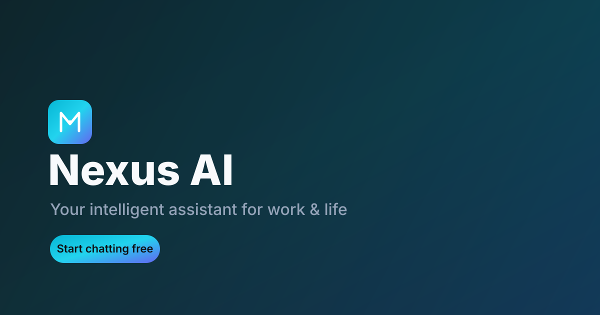

# Nexus AI

A production-ready AI assistant web application — a modern personal & business AI
platform designed to grow into an AI agent ecosystem.



## Features

**Version 1**

- **AI Chat System** — real-time streaming conversations, model selector
  dropdown, multiple chat sessions, new-chat button.
- **Multi-model support** — Groq, Google Gemini, and OpenRouter (optional),
  all routed through a single Supabase Edge Function proxy.
- **User system** — email/password sign-up & login, user profiles, saved
  preferences (default model, system prompt, temperature, theme).
- **Chat memory** — every conversation is persisted and synced; chats are
  grouped by date, pinnable, renameable, and searchable by title or content.
- **File tools** — upload PDFs, extract text in-browser, and generate concise
  summaries with key points.
- **Productivity tools** — copy any response, export a chat as Markdown / text /
  JSON, full-text search across all conversations.
- **UI** — premium SaaS interface, beautiful sidebar, profile & settings pages,
  dark/light/system theme, loading & streaming animations, graceful error
  handling, fully mobile-responsive.

**Roadmap (modular architecture ready)**

Study Mode · Coding Assistant · Business Assistant · SEO Assistant ·
AI Website Builder · AI Automation Agents · Image Analysis · Voice Assistant.

## Tech stack

- **Frontend:** React 18 + Vite + TypeScript + Tailwind CSS + lucide-react
- **Backend:** Supabase Edge Functions (Deno) — AI proxy with SSE streaming
- **Database:** Supabase Postgres with Row Level Security
- **AI:** Groq, Gemini, OpenRouter (optional), with a demo-mode fallback
- **PDF:** in-browser extraction via `pdfjs-dist`

## Getting started

```bash
npm install
npm run dev
```

The dev server starts automatically; open the printed local URL.

### Environment variables

Copy `.env.example` to `.env` and fill in the Supabase values (already
provisioned for Bolt projects):

```
VITE_SUPABASE_URL=...
VITE_SUPABASE_ANON_KEY=...
```

**AI provider keys** are configured as **Edge Function secrets** in Supabase
(Project Settings → Edge Functions → Secrets), not in your local `.env`:

| Secret              | Where to get it                     | Required? |
| ------------------- | ----------------------------------- | --------- |
| `GROQ_API_KEY`      | https://console.groq.com/keys       | optional  |
| `GEMINI_API_KEY`    | https://aistudio.google.com/apikey  | optional  |
| `OPENROUTER_API_KEY`| https://openrouter.ai/keys          | optional  |

If no provider keys are set, Nexus AI runs in **demo mode** and returns canned,
streamed responses so you can explore the full UI without any keys. Add at
least one key to enable live AI responses.

### Available models

Models are defined in `src/lib/models.ts`. The edge function maps the
`provider/model-id` you select to the correct upstream API. Add or remove
entries there to curate the model selector dropdown.

## Project structure

```
src/
  components/
    app/         AppLayout, Sidebar
    auth/        login & signup form
    chat/        ChatView, MessageBubble, ChatInput, WelcomeScreen
    documents/   PDF upload + summarize view
    landing/     marketing landing page
    settings/    profile, AI preferences, appearance
    ui/          Button, Modal, Avatar, ModelSelector, Logo, Seo, …
  context/       AuthContext, ThemeContext, ToastContext
  lib/           supabase client, types, models, ai streaming, pdf, utils
supabase/
  functions/
    ai-chat/     streaming AI proxy edge function
public/          favicon, robots.txt, sitemap.xml, og-image
```

## Database

The schema is applied via Supabase migrations (run automatically during setup):

- `profiles` — user display info
- `user_preferences` — default model, system prompt, temperature, theme
- `chats` — conversation sessions
- `messages` — chat messages
- `documents` — uploaded PDF metadata + summaries
- `storage.objects` in the `documents` bucket — PDF files

Every table has **Row Level Security** enabled; users can only read and write
their own rows. New users get a profile + preferences row automatically via a
database trigger.

## Scripts

```bash
npm run dev        # start dev server
npm run build      # production build → dist/
npm run typecheck  # TypeScript check
npm run preview    # preview the production build
npm run lint       # eslint
```

## Deployment

Nexus AI is a static SPA — deploy the `dist/` folder to any static host.

### Vercel

Import the repo; `vercel.json` is included with the correct build settings and
SPA rewrites. No extra configuration needed.

### Netlify

`netlify.toml` is included with build command, publish directory, and SPA
redirects. Connect the repo and deploy.

### Environment on the host

Set `VITE_SUPABASE_URL` and `VITE_SUPABASE_ANON_KEY` as build-time environment
variables on your host. Provider API keys live in Supabase Edge Function
secrets (see above), not on the host.

## SEO & performance

- Pre-rendered meta tags (Open Graph, Twitter cards) in `index.html`
- `robots.txt` and `sitemap.xml` in `public/`
- Route-level `<Seo />` updates document title & meta per view
- Code-split friendly structure; fonts preconnect; theme applied pre-paint to
  avoid flash

## License

MIT
